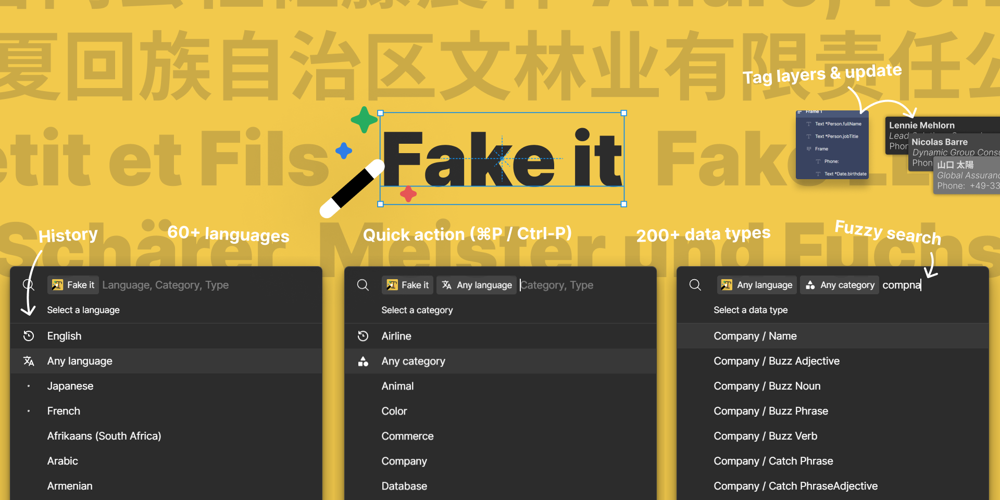

#  [Fake it](https://www.figma.com/community/plugin/1291306802526613625/fake-it)

Insert or replace texts with random fake (but realistic) data, using Figma quick action menu (⌘P and Ctrl-P or ⌘/ and Ctrl-/).

🪄 200+ types of data and 60+ languages from [faker.js](https://fakerjs.dev/).
